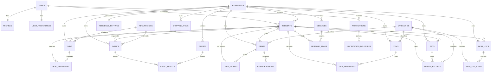

# DER — Diagrama Entidade Relacionamento

```mermaid
erDiagram

USERS ||--|| PROFILES : has
USERS ||--|| USER_PREFERENCES : has
USERS ||--o{ RESIDENTS : participates
USERS ||--o{ NOTIFICATIONS : receives

RESIDENCES ||--|| RESIDENCE_SETTINGS : configures
RESIDENCES ||--o{ RESIDENTS : contains
RESIDENCES ||--o{ GUESTS : contains
RESIDENCES ||--o{ TASKS : owns
RESIDENCES ||--o{ EVENTS : owns
RESIDENCES ||--o{ MESSAGES : owns
RESIDENCES ||--o{ DEBITS : owns
RESIDENCES ||--o{ ITEMS : owns
RESIDENCES ||--o{ SHOPPING_ITEMS : owns
RESIDENCES ||--o{ PETS : owns
RESIDENCES ||--o{ WISH_LISTS : owns

RESIDENTS ||--o{ TASKS : assigned
RESIDENTS ||--o{ TASK_EXECUTIONS : executes
RESIDENTS ||--o{ EVENTS : responsible
RESIDENTS ||--o{ MESSAGE_READS : reads
RESIDENTS ||--o{ DEBITS : pays
RESIDENTS ||--o{ DEBIT_SHARES : participates
RESIDENTS ||--o{ ITEM_MOVEMENTS : performs
RESIDENTS ||--o{ PETS : owns
RESIDENTS ||--o{ HEALTH_RECORDS : owns
RESIDENTS ||--o{ WISH_LISTS : owns

TASKS ||--o{ TASK_EXECUTIONS : generates

RECURRENCES ||--o{ TASKS : schedules
RECURRENCES ||--o{ EVENTS : schedules

EVENTS ||--o{ EVENT_GUESTS : invites
GUESTS ||--o{ EVENT_GUESTS : attends

MESSAGES ||--o{ MESSAGE_READS : requires

DEBITS ||--o{ DEBIT_SHARES : splits
DEBITS ||--o{ REIMBURSEMENTS : generates

ITEMS ||--o{ ITEM_MOVEMENTS : tracks

PETS ||--o{ HEALTH_RECORDS : owns

CATEGORIES ||--o{ DEBITS : classifies
CATEGORIES ||--o{ ITEMS : classifies
CATEGORIES ||--o{ HEALTH_RECORDS : classifies
CATEGORIES ||--o{ WISH_LIST_ITEMS : classifies

WISH_LISTS ||--o{ WISH_LIST_ITEMS : contains

NOTIFICATIONS ||--o{ NOTIFICATION_DELIVERIES : delivers
```
