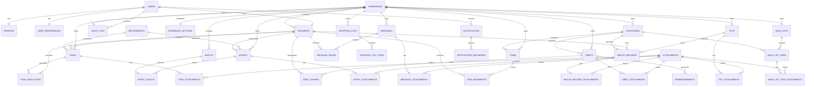

# DER (Diagrama Entidade-Relacionamento)

```mermaid
erDiagram

USERS ||--|| PROFILES : has
USERS ||--|| USER_PREFERENCES : has
USERS ||--|| RESIDENTS : owns
USERS ||--o{ AUDIT_LOGS : performs
USERS ||--o{ NOTIFICATIONS : receives

RESIDENCES ||--|| RESIDENCE_SETTINGS : configures

RESIDENCES ||--o{ RESIDENTS : contains
RESIDENCES ||--o{ GUESTS : contains

RESIDENCES ||--o{ TASKS : owns
RESIDENCES ||--o{ EVENTS : owns
RESIDENCES ||--o{ MESSAGES : owns
RESIDENCES ||--o{ DEBITS : owns
RESIDENCES ||--o{ ITEMS : owns
RESIDENCES ||--o{ SHOPPING_LISTS : owns
RESIDENCES ||--o{ PETS : owns
RESIDENCES ||--o{ WISH_LISTS : owns
RESIDENCES ||--o{ CATEGORIES : owns
RESIDENCES ||--o{ AUDIT_LOGS : owns

RESIDENTS ||--o{ TASKS : assigned
RESIDENTS ||--o{ TASK_EXECUTIONS : executes

TASKS ||--o{ TASK_EXECUTIONS : generates

RECURRENCES ||--o{ TASKS : schedules
RECURRENCES ||--o{ EVENTS : schedules

RESIDENTS ||--o{ EVENTS : responsible

EVENTS ||--o{ EVENT_GUESTS : invites
GUESTS ||--o{ EVENT_GUESTS : attends

MESSAGES ||--o{ MESSAGE_READS : requires
RESIDENTS ||--o{ MESSAGE_READS : confirms

DEBITS ||--o{ DEBIT_SHARES : splits
DEBITS ||--o{ REIMBURSEMENTS : generates

RESIDENTS ||--o{ DEBIT_SHARES : participates

ITEMS ||--o{ ITEM_MOVEMENTS : tracks
RESIDENTS ||--o{ ITEM_MOVEMENTS : performs

SHOPPING_LISTS ||--o{ SHOPPING_LIST_ITEMS : contains

PETS ||--o{ HEALTH_RECORDS : owns
RESIDENTS ||--o{ HEALTH_RECORDS : owns

WISH_LISTS ||--o{ WISH_LIST_ITEMS : contains

CATEGORIES ||--o{ DEBITS : classifies
CATEGORIES ||--o{ ITEMS : classifies
CATEGORIES ||--o{ HEALTH_RECORDS : classifies
CATEGORIES ||--o{ WISH_LIST_ITEMS : classifies

NOTIFICATIONS ||--o{ NOTIFICATION_DELIVERIES : delivers

ATTACHMENTS ||--o{ TASK_ATTACHMENTS : linked
ATTACHMENTS ||--o{ EVENT_ATTACHMENTS : linked
ATTACHMENTS ||--o{ MESSAGE_ATTACHMENTS : linked
ATTACHMENTS ||--o{ DEBIT_ATTACHMENTS : linked
ATTACHMENTS ||--o{ HEALTH_RECORD_ATTACHMENTS : linked
ATTACHMENTS ||--o{ PET_ATTACHMENTS : linked
ATTACHMENTS ||--o{ WISH_LIST_ITEM_ATTACHMENTS : linked

TASKS ||--o{ TASK_ATTACHMENTS : has
EVENTS ||--o{ EVENT_ATTACHMENTS : has
MESSAGES ||--o{ MESSAGE_ATTACHMENTS : has
DEBITS ||--o{ DEBIT_ATTACHMENTS : has
HEALTH_RECORDS ||--o{ HEALTH_RECORD_ATTACHMENTS : has
PETS ||--o{ PET_ATTACHMENTS : has
WISH_LIST_ITEMS ||--o{ WISH_LIST_ITEM_ATTACHMENTS : has
```
